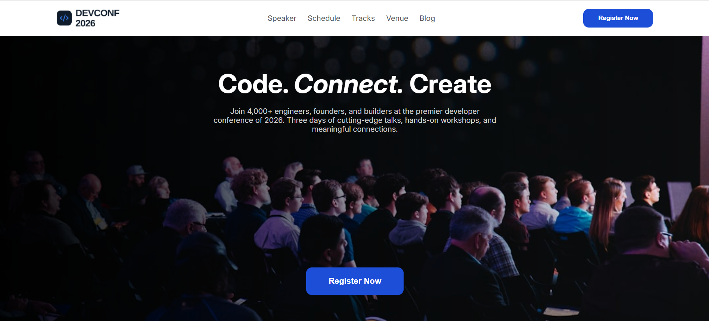

# DevConf 2026

A clean and simple landing page for a developer conference happening in San Francisco. It shows who's speaking, how much the tickets cost, and how to get to the venue.

**Live Demo:** [https://abirjuboraj.github.io/B14-A01/](https://abirjuboraj.github.io/B14-A01/)




---

## Overview

DevConf 2026 is a landing page for an exciting three-day conference for engineers, founders, and builders. Visitors can check out the speakers, compare ticket plans, and find venue details like parking, transit, and accessibility, all in one page.

---

## Main Technologies

- **HTML5** for the page structure
- **CSS3** for styling and layout
- **GitHub Pages** for hosting

---

## Features

- **Hero section** with a bold tagline and a "Register Now" button
- **Speaker showcase** covering four tracks: AI/ML, Cloud & DevOps, Frontend, and Security
- **Three ticket plans** to choose from: Standard, Pro, and Team
- **Venue section** with the address, parking info, nearest transit, and accessibility details
- **Responsive design** that works on mobile, tablet, and desktop
- **Footer** with social media links, Privacy Policy, and Terms of Service

---

## Dependencies

This project doesn't need any package or library to run. It's plain HTML and CSS, so there's nothing to install.

---

## How to Run Locally

1. **Clone the repository**
   ```bash
   git clone https://github.com/abirjuboraj/B14-A01.git
   ```

2. **Go to the project folder**
   ```bash
   cd B14-A01
   ```

3. **Open the project**
   - Double-click `index.html` to open it in your browser, or
   - If you use VS Code, right-click `index.html` and choose **Open with Live Server**

That's it. No build step needed.

---

## Project Structure

```
B14-A01/
├── assets/
│   ├── icons/
│   ├── logo.png
│   └── ...
├── index.html
└── style.css
```

---

## Links

- **Live Site:** [https://abirjuboraj.github.io/B14-A01/](https://abirjuboraj.github.io/B14-A01/)
- **GitHub Repository:** [https://github.com/abirjuboraj/B14-A01](https://github.com/abirjuboraj/B14-A01)

---

## Author

**Abir Hossen Juboraj**
GitHub: [@abirjuboraj](https://github.com/abirjuboraj)
